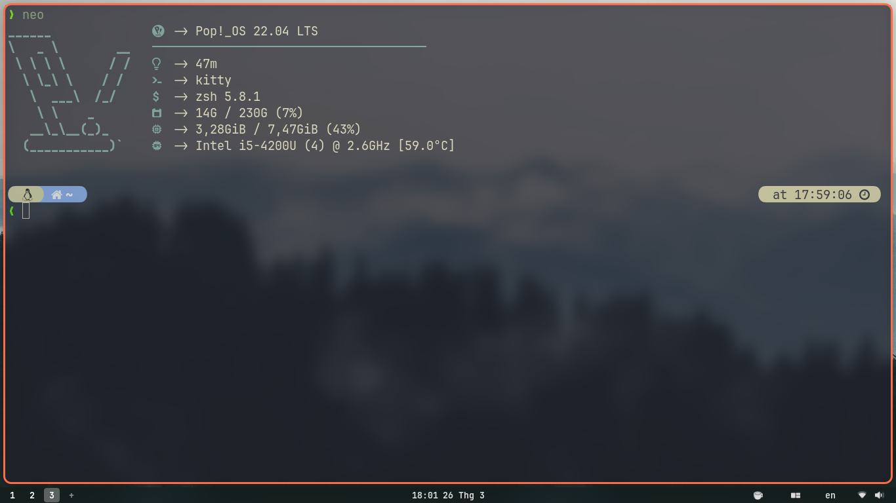
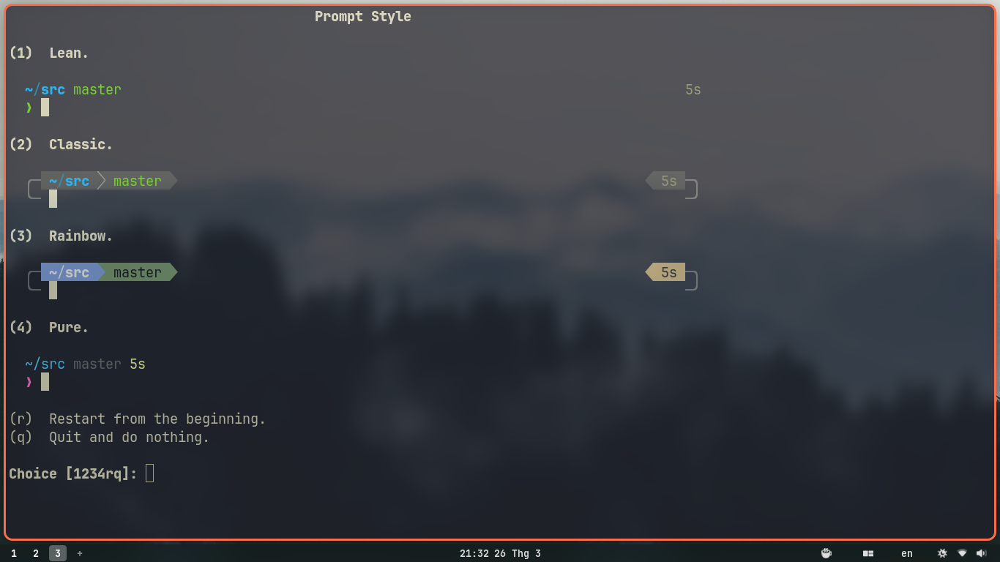
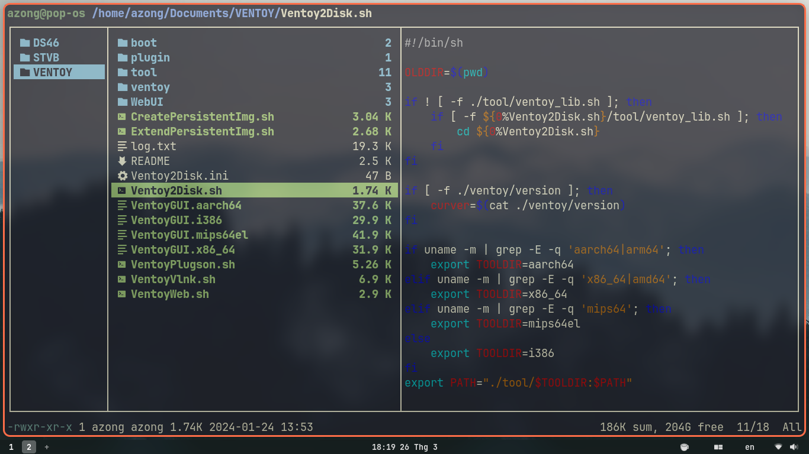
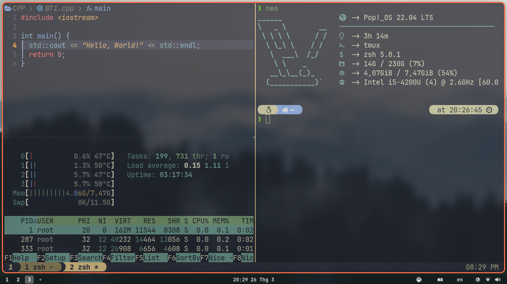
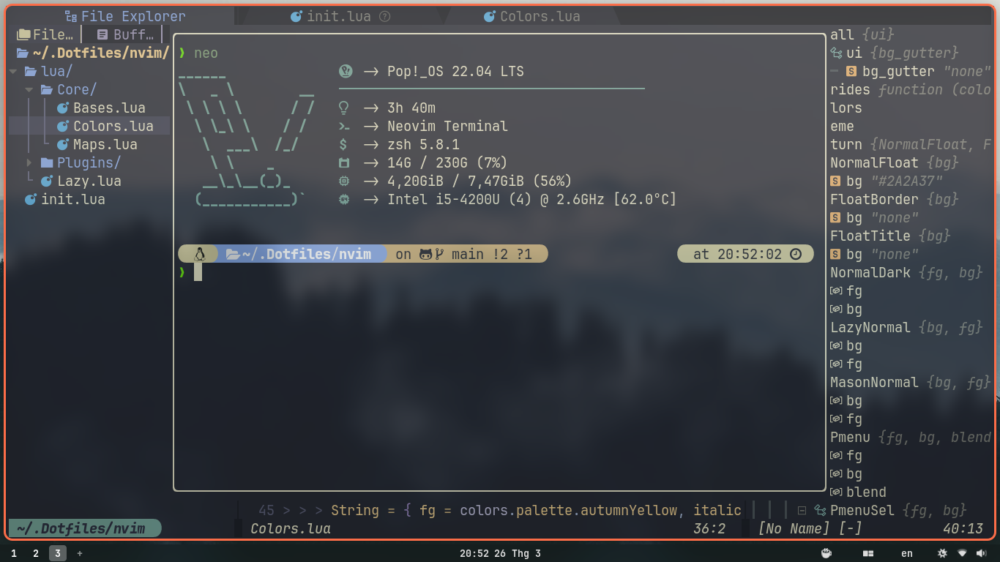

# My Dotfiles

**System**: [Pop!\_OS 22.04 LTS](https://pop.system76.com/)

---

### Terminal: [Kitty](https://sw.kovidgoyal.net/kitty/)



- PPA:
  ```bash
  sudo add-apt-repository ppa:yurivkhan/kitty
  ```
- Font: [JetBrains Mono NerdFont](https://www.nerdfonts.com/)
  ```bash
  wget https://github.com/ryanoasis/nerd-fonts/releases/download/v3.1.1/JetBrainsMono.zip
  ```
- Theme: **Kanagawa**

---

### Shell: [Zsh](https://github.com/ohmyzsh/ohmyzsh/wiki/Installing-ZSH) [- OMZ](https://ohmyz.sh/)



- Plugins:

  - Git
  - [nvm](https://github.com/nvm-sh/nvm)

  ```bash
  curl -o- https://raw.githubusercontent.com/nvm-sh/nvm/v0.39.7/install.sh | bash
  ```

  - [zsh-vi-mode](https://github.com/jeffreytse/zsh-vi-mode)

  ```bash
  git clone https://github.com/jeffreytse/zsh-vi-mode \
    $ZSH_CUSTOM/plugins/zsh-vi-mode
  ```

  - [fzf-zsh-plugin](https://github.com/unixorn/fzf-zsh-plugin)

  ```bash
  git clone --depth 1 https://github.com/unixorn/fzf-zsh-plugin.git ${ZSH_CUSTOM:-~/.oh-my-zsh/custom}/plugins/fzf-zsh-plugin
  ```

  - [zsh-autosuggestions](https://github.com/zsh-users/zsh-autosuggestions)

  ```bash
  git clone https://github.com/zsh-users/zsh-autosuggestions ${ZSH_CUSTOM:-~/.oh-my-zsh/custom}/plugins/zsh-autosuggestions
  ```

  - [zsh-syntax-highlighting](https://github.com/zsh-users/zsh-syntax-highlighting)

  ```bash
  git clone https://github.com/zsh-users/zsh-syntax-highlighting.git ${ZSH_CUSTOM:-~/.oh-my-zsh/custom}/plugins/zsh-syntax-highlighting
  ```

  - [Colorls - required Ruby Gem](https://github.com/athityakumar/colorls)

  ```bash
  sudo gem install colorls

  # .zshrc or .bashrc
  source $(dirname $(gem which colorls))/tab_complete.sh
  ```

  - [Zoxide](https://github.com/ajeetdsouza/zoxide)

  ```bash
  curl -sS https://raw.githubusercontent.com/ajeetdsouza/zoxide/main/install.sh | bash

  # .zshrc or .bashrc
  eval "$(zoxide init zsh)"
  ```

---

### File Manager: [Ranger](https://github.com/ranger/ranger)



- Plugins:

  - [Devicons](https://github.com/alexanderjeurissen/ranger_devicons)

  ```bash
  git clone https://github.com/alexanderjeurissen/ranger_devicons ~/.config/ranger/plugins/ranger_devicons
  echo "default_linemode devicons" >> $HOME/.config/ranger/rc.conf
  ```

---

### Terminal Multiplexer: [Tmux](https://github.com/tmux/tmux/wiki)



- Plugins:

  - [Tmux Plugin Manager](https://github.com/tmux-plugins/tpm)

  ```bash
  git clone https://github.com/tmux-plugins/tpm ~/.config/tmux/plugins/tpm
  ```

  - Theme: [Kanagawa-tmux](https://github.com/obergodmar/kanagawa-tmux)

  ```vim
  set -g @plugin 'obergodmar/kanagawa-tmux'
  ```

  - [Tmux-auto-renumber-session](https://github.com/T1erno/tmux-auto-renumber-session)

  ```vim
  set -g @plugin 'T1erno/tmux-auto-renumber-session'
  ```

  - [Tmux-continuum](https://github.com/tmux-plugins/tmux-continuum) + [Tmux-resurrect](https://github.com/tmux-plugins/tmux-resurrect)

  ```vim
  set -g @plugin 'tmux-plugins/tmux-resurrect'
  set -g @plugin 'tmux-plugins/tmux-continuum'
  ```

  - [Tmux-sensible](https://github.com/tmux-plugins/tmux-sensible)

  ```vim
  set -g @plugin 'tmux-plugins/tmux-sensible'
  ```

  - [Tmux-yank](https://github.com/tmux-plugins/tmux-yank)

  ```vim
  set -g @plugin 'tmux-plugins/tmux-yank'
  ```

---

### Required

- [Nala](https://gitlab.com/volian/nala/-/wikis/Installation)

  ```bash
  sudo apt install nala -y
  ```

- Unzip

  ```bash
  sudo apt install unzip -y
  ```

- Java

  ```bash
  sudo nala install default-jre -y
  ```

- Ruby Gem

  ```bash
  sudo nala install ruby ruby-dev -y
  ```

- Julia, composer, php, luarocks, luajit

  ```bash
  sudo nala install julia composer php luarocks luajit -y
  ```

- [Golang](https://go.dev/doc/install)

  ```bash
  wget https://go.dev/dl/

  rm -rf /usr/local/go && tar -C /usr/local -xzf # file name

  # .profile
  export PATH=$PATH:/usr/local/go/bin
  ```

- [Python](https://www.python.org/downloads/)

  ```bash
  wget https://www.python.org/downloads/release/python-3122/

  # After downloaded Python file
  ./configure && sudo make && sudo make install
  ```

- [Cargo](https://doc.rust-lang.org/cargo/getting-started/installation.html)

  ```bash
  curl https://sh.rustup.rs -sSf | sh
  ```

- Node

  ```bash
  nvm install node
  ```

- Yarn

  ```bash
  npm install -g yarn
  ```

- [Deno](https://deno.com/)

  ```bash
  curl -fsSL https://deno.land/install.sh | sh

  # .zshrc or .bashrc
  export DENO_INSTALL="/home/${USER}/.deno"
  export PATH="$DENO_INSTALL/bin:$PATH"
  ```

---

### Text Editor: [NeoVim](https://github.com/neovim/neovim)



- PPA:

  ```bash
  # Stable
  sudo add-apt-repository ppa:neovim-ppa/stable

  # Unstable
  sudo add-apt-repository ppa:neovim-ppa/unstable
  ```

- Plugin Manager: [Lazy.nvim](https://github.com/folke/lazy.nvim)
- Plugins:
  - Colorscheme: [Kanagawa.nvim](https://github.com/rebelot/kanagawa.nvim) `rebelot/kanagawa.nvim`
  - Icon: [Devicons](https://github.com/nvim-tree/nvim-web-devicons) `nvim-tree/nvim-web-devicons`
  - Highlight color: [NvChad/nvim-colorizer.lua](https://github.com/NvChad/nvim-colorizer.lua) `NvChad/nvim-colorizer.lua`
  - File search: [Telescope.nvim](https://github.com/nvim-telescope/telescope.nvim) `nvim-telescope/telescope.nvim`
  - File tree: [Neo-tree.nvim](https://github.com/nvim-neo-tree/neo-tree.nvim) `nvim-neo-tree/neo-tree.nvim`
  - Buffer manager: [Bufferline.nvim](https://github.com/akinsho/bufferline.nvim) `akinsho/bufferline.nvim`
  - Status line: [Lualine.nvim](https://github.com/nvim-lualine/lualine.nvim) `nvim-lualine/lualine.nvim`
  - Terminal: [Toggleterm.nvim](https://github.com/akinsho/toggleterm.nvim) `akinsho/toggleterm.nvim`
  - Code syntax: [nvim-treesitter](https://github.com/nvim-treesitter/nvim-treesitter) `nvim-treesitter/nvim-treesitter`
  - Git: [Gitsigns.nvim](https://github.com/lewis6991/gitsigns.nvim) `lewis6991/gitsigns.nvim`
  - LSP manager: [Mason.nvim](https://github.com/williamboman/mason.nvim) `williamboman/mason.nvim`
  - LSP configuration: [Nvim-lspconfig](https://github.com/neovim/nvim-lspconfig) `neovim/nvim-lspconfig`
  - Autocompletion: [nvim-cmp](https://github.com/hrsh7th/nvim-cmp/releases) `hrsh7th/nvim-cmp`
  - Formatting and Linting: [None-ls.nvim](https://github.com/nvimtools/none-ls.nvim) `nvimtools/none-ls.nvim`
  - VS-Code icons: [Lspkind.nvim](https://github.com/onsails/lspkind.nvim) `onsails/lspkind.nvim`
  - etc
